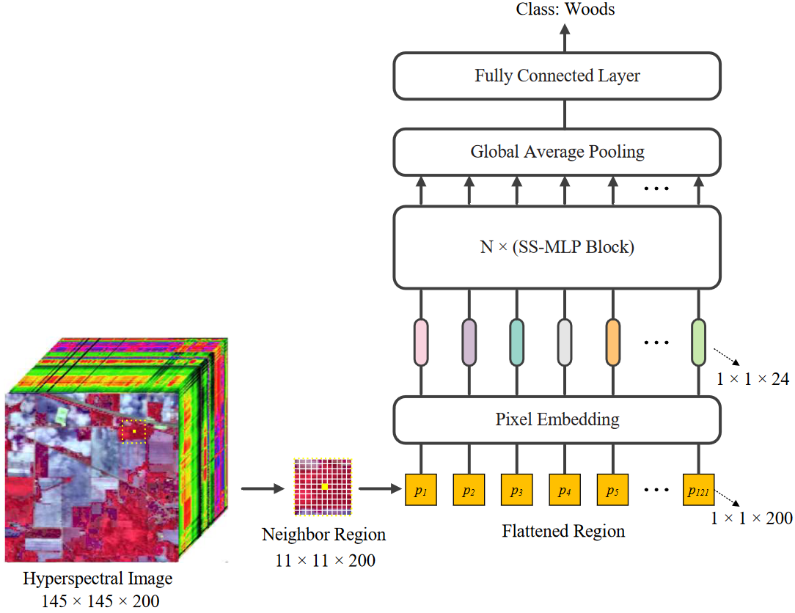
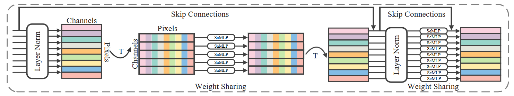

# SS-MLP

# SS-MLP: A Novel Spectral-Spatial MLP Architecture for Hyperspectral Image Classification

PyTorch implementation of SS-MLP: A Novel Spectral-Spatial MLP Architecture for Hyperspectral Image Classification.



# Basic Usage

```
import torch
from SSMLP import SSMLP

model = SSMLP(num_classes=16, channels=200, patchsize=11)
model.eval()
print(model)
input = torch.randn(100, 200, 11, 11)
y = model(input)
print(y.size())  # (100, 16)
```

# Paper

[SS-MLP: A Novel Spectral-Spatial MLP Architecture for Hyperspectral Image Classification](https://www.mdpi.com/2072-4292/13/20/4060)

Please cite our paper if you find it useful for your research.

```
@article{meng2021ss,
  title={SS-MLP: A novel spectral-spatial MLP architecture for hyperspectral image classification},
  author={Meng, Zhe and Zhao, Feng and Liang, Miaomiao},
  journal={Remote Sensing},
  volume={13},
  number={20},
  pages={4060},
  year={2021},
  publisher={MDPI}
}
```
# Reference Paper

* MLP-Mixer: An all-MLP Architecture for Vision https://arxiv.org/abs/2105.01601

# Reference Code

* mlp-mixer-pytorch https://github.com/lucidrains/mlp-mixer-pytorch
